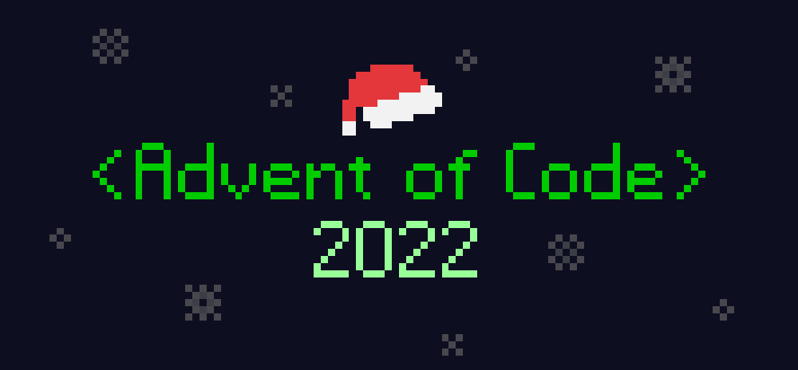

	<h1 align="center">Advent of Code 2022</h1>

	
	
	
	   
	

## Introduction
My [AOC 2022](https://adventofcode.com/2022) solutions

| Day        | Language                                                              |
| ---------- | --------------------------------------------------------------------- |
| [01](./01) | [Pascal](https://en.wikipedia.org/wiki/Pascal_(programming_language)) |
| [02](./02) | [C](https://en.wikipedia.org/wiki/C_(programming_language))           |
| [03](./03) | [Go](https://go.dev/)                                                 |
| [04](./04) | [JS](https://en.wikipedia.org/wiki/JavaScript)                        |
| [05](./05) | [Lua](https://www.lua.org/)                                           |
| [06](./06) | [C++](https://en.wikipedia.org/wiki/C%2B%2B)                          |
| [07](./07) | [Python](https://www.python.org/)                                     |
| [08](./08) | [D](https://dlang.org/)                                               |
| [09](./09) | [Zig](https://ziglang.org/)                                           |
| [10](./10) | [C#](https://en.wikipedia.org/wiki/C_Sharp_(programming_language))    |
| [11](./11) | [Nim](https://nim-lang.org/)                                          |
